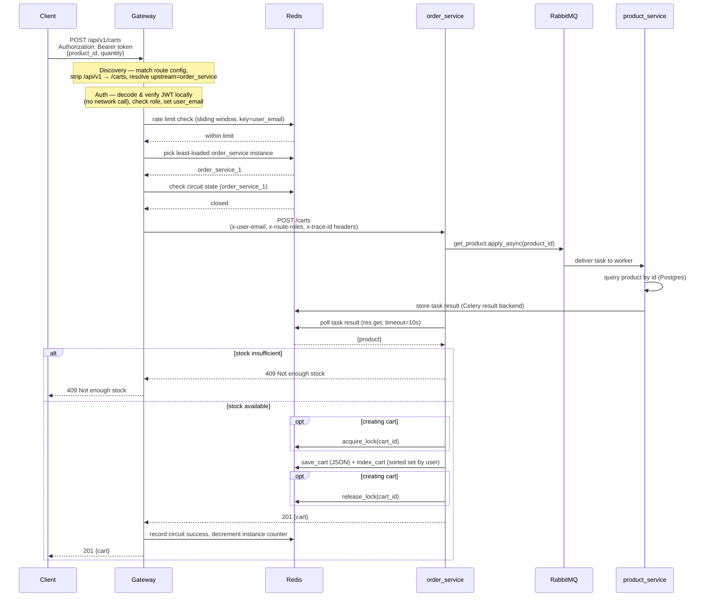

# Relay

Relay is a custom, hand-rolled API gateway designed to sit at the edge of a backend services. It handles request routing, service discovery, load balancing, circuit breaking, auth, and rate limiting.

---

## Tech Stack


---

## Architecture

```
                         ┌────────────────────┐
                         │   relay_gateway     │  :8000
                         │  (custom gateway)   │
                         │  auth · rate-limit  │
                         │  circuit breaker    │
                         │  load balancer      │
                         └──────────┬──────────┘
              ┌───────────────────┼───────────────────┐
              ▼                    ▼                    ▼
      user_service (x2)    order_service (x2)    product_service (x2)
        :8001 / :8002        :8003 / :8004         :8005 / :8006
              │                    │                    │
              └────────────────────┼────────────────────┘
                                   ▼
                    Postgres (single shared database)
                                   │
                    Redis (idempotency keys, cache, pub/sub)
                                   │
                    RabbitMQ (Celery broker) ── workers:
                                                  relay_log_worker
                                                  relay_email_worker
                                                  relay_product_worker
```

---

**What this README covers**
- Project overview and core goals
- Design Principles
- Gateway responsibilities and concepts
- Gateway Configuration
- Routes and description
- Architecture and request flow
- Sample Services
- Getting Started
- Environment Configuration
- Service Test Suites

---

**Project Goals**
- Provide a single, extensible entrypoint for internal and external traffic
- Centralize cross-cutting concerns: routing, authentication, rate limiting
- Provide a centralized view of Swagger documentation

---

**Design principles**

- Keep the gateway thin: orchestrate rather than implement business logic.
- Fail fast and fail loud: invalid requests and misconfigured paths should be rejected with useful error messages and traceable logs.
- Be configurable: routing, auth, and limits should be data-driven (env/config files).

---

## Gateway (Primary Focus)

The `gateway` is responsible for:

- **logging and tracing** — assigns each request a unqiue trace_id to track hop across services
- **discovery** — resolves a logical upstream name (`user_service`, `order_service`, `product_service`) to a live instance from `gateway/app/core/config.yml`
- **Authentication & Authorization** — validates tokens, enforce roles, and reject or forward requests accordingly.
- **rate_limiting** — per-route limits keyed by IP or user email, backed by Redis Lua Script
- **load_balancer** — selects instance using least connections algorithm
- **circuit_breaker** — trips per-upstream after a configurable failure threshold and short-circuits requests until a recovery timeout passes
- **proxy** — forwards the request to the chosen instance over `httpx` with custom headers, stripping connection-specific headers

---

## Gateway Configuration

Routes, auth requirements, roles, and rate limits are all declarative in `gateway/app/core/config.yml` — adding a route, or a new upstream instance, doesn't require touching gateway code:

```yaml
upstreams:
  - name: order_service
    instances:
      - http://order_service_1:8003
      - http://order_service_2:8004

circuit_breaker:
  failure_threshold: 5
  recovery_timeout: 60s
  half_open_requests: 2

routes:
  - path: /api/v1/orders
    methods: ["get", "post", "delete"]
    strip_prefix: /api/v1
    auth_required: true
    roles: [admin, user]
    rate_limit:
      requests: 50
      window: 60s
      key_by: user_email
```

An admin-only endpoint (`PATCH /admin/config/reload`) hot-reloads this file without restarting the gateway.

---

## Routes exercised through the gateway

All routes below are mounted behind the gateway at `/api/v1`, proxied to whichever sample service owns them.

### Auth — `user_service`

| Method | Path | Description |
|---|---|---|
| POST | `/auth/signup` | Create an account |
| GET | `/auth/google` | Start Google OAuth sign-in |
| GET | `/auth/google/callback` | Google OAuth redirect target |
| PATCH | `/auth/verify` | Verify account with an emailed OTP |
| POST | `/auth/verify/resend` | Resend the verification code |
| POST | `/auth/login` | Log in with email + password |
| POST | `/auth/refresh` | Exchange a refresh token for a new access token |
| GET | `/auth/me` | Get the current authenticated user |
| POST | `/auth/logout` | Log out (revokes the refresh token) |
| DELETE | `/auth` | Permanently delete the account |
| PATCH | `/admin/config/reload` | Reload the gateway's `config.yml` (admin only) |

### Products — `product_service`

| Method | Path | Description |
|---|---|---|
| GET | `/products` | Paginated product listing |
| GET | `/products/all` | Cursor-paginated full listing (sort/order/limit) |
| GET | `/products/{id}` | Get a product by id |
| POST | `/products` | Create a product (admin only) |
| PATCH | `/products/{id}` | Update a product (admin only) |
| DELETE | `/products/{id}` | Delete a product (admin only) |

### Carts & Orders — `order_service`

| Method | Path | Description |
|---|---|---|
| GET | `/carts` | List the current user's carts |
| GET | `/carts/{id}` | Get a cart by id |
| POST | `/carts` | Create a cart, or add an item to an existing one |
| PATCH | `/carts/{cart_id}/products/{product_id}/remove` | Remove an item (deletes the cart if it's the last one) |
| PATCH | `/carts/{cart_id}/products/{product_id}/increment` | Increase an item's quantity |
| PATCH | `/carts/{cart_id}/products/{product_id}/decrement` | Decrease an item's quantity |
| DELETE | `/carts/{id}` | Delete a cart |
| GET | `/orders` | List the current user's orders |
| GET | `/orders/{id}` | Get an order by id |
| POST | `/orders` | Check out a cart into an order (runs the reserve/confirm saga) |
| DELETE | `/orders/{id}` | Delete an order (compensates stock based on its status) |

---

### Typical request flow



---

## The sample services

Three independent FastAPI apps, each backed by its own repo/service/router layers but sharing one Postgres database and one SQLAlchemy model registry (`shared/models/base.py`) — so cross-service foreign keys (e.g. `product_reserves.order_id → orders.id`) are enforced at the database level even though the owning code lives in different apps.

| Service | Responsibility |
|---|---|
| `user_service` | Signup/login, email+OTP verification, Google OAuth, JWT access/refresh tokens |
| `product_service` | Product catalog, stock reservation, and the Celery worker that owns all stock mutations |
| `order_service` | Carts, checkout, and order lifecycle orchestration — calls into `product_service`'s worker to reserve/confirm/release stock |

`order_service`'s checkout flow is the one genuinely nontrivial piece of business logic in the fixtures, mainly because it's a good stress test for the gateway (multi-step, cross-service, async via Celery): reserving stock happens in `product_service`'s worker on a separate DB connection, so it can't be one atomic transaction. `order_service` runs a small saga instead, tracked via `OrderStatus`:

```
processing ──reserve + confirm succeed──▶ confirmed ──▶ delivered
    │
    └──reserve/confirm fails──▶ cancelled
```

The order is committed as `processing` *before* the reservation task is dispatched (required under READ COMMITTED — the worker's connection can't see an uncommitted row), moves to `confirmed` once stock is deducted, or `cancelled` with any partial hold released if reservation fails. Deleting an order compensates based on that status. All the Celery calls involved are idempotent (a Redis key per `message_id`) and time-bounded, so an unresponsive worker surfaces as a clean 503 rather than hanging the request.

---

## Getting Started (Local)

Prerequisites:

- Python 3.10+
- `docker` and `docker-compose` (optional, recommended for multi-service local runs)

Run using Docker Compose (recommended):

```bash
docker-compose up --build
```

This brings up Postgres, Redis, RabbitMQ, pgAdmin, the three Celery workers, both replicas of each service, and the gateway. A one-shot `migrate` container runs `alembic upgrade head` and seeds a handful of demo products before the services start.

The gateway is the only port you should need directly:

- API: `http://localhost:8000/api/v1`
- Docs: `http://localhost:8000/docs`
- pgAdmin: `http://localhost:5050`
- RabbitMQ management: `http://localhost:15672`

### Environment Configuration

Settings are loaded via `pydantic-settings` from a `.env` file (see `shared/core/shared_config.py` and `apps/user_service/app/core/config.py`). Run and replace env values:

```bash
cp .env.example .env
```

Run locally:

```bash
uv sync
alembic upgrade head
python -m scripts.seed_products

uvicorn apps.user_service.app.main:app --port 8001 --reload
uvicorn apps.order_service.app.main:app --port 8003 --reload
uvicorn apps.product_service.app.main:app --port 8005 --reload
uvicorn gateway.app.main:app --port 8000 --reload

celery -A shared.worker.celery_app worker -Q relay.product -P gevent -l info
celery -A shared.worker.celery_app worker -Q relay.email -P gevent -l info
celery -A shared.worker.celery_app worker -Q relay.log -P gevent -l info
```

---

### Tests

Each service has its own test suite under `apps/<service>/test/`, running against `ASYNC_TEST_DB_URL` with Celery tasks mocked out. The gateway has its own suite under `gateway/test/`.

```bash
pytest -v gateway/test/
pytest -v apps/order_service/test/
pytest -v apps/product_service/test/
pytest -v apps/user_service/test/
```
